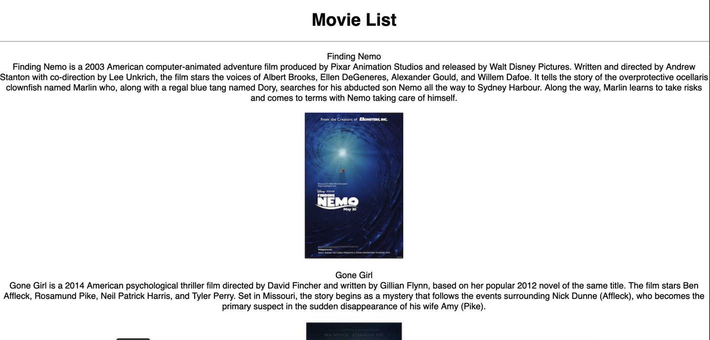
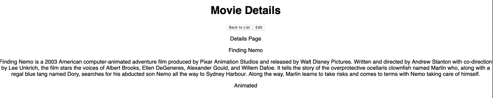
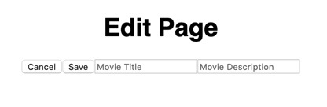

# React Sagas
React Sagas is an app that takes a list of movies and their descriptions from a database. These movies can be clicked on to see individual information. They can also be edited and the information entered will update the database.

### Setup
```
npm install
npm run server
npm run client
```

## Built With

- Javascript
- HTML
- CSS
- React
- Redux
- Sagas
- SQL

## Getting Started

Steps to get the development environment running.

1. Download this project.
2. `npm install`
3. `npm start`

Screen Shots






## Feature 
- [x] Viewing the list of movies, their descriptions, and their images.
- [x] Seeing the movie details on a separate details page.
- [x] Ability to update the title and description of the movie which will then be saved in the database.

## Authors
* Molly Brittenham Ellison

## Acknowledgments
* Kyle Olson
